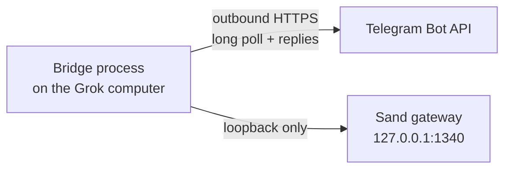

<div align="center">

# Grok Bot ↔ Telegram Bridge

**A self-hosted Telegram gateway for [Grok Bot](https://grok.com)'s remote computer**

[](https://github.com/SSBrouhard/grokbot-telegram-bridge/actions/workflows/ci.yml)
[](https://nodejs.org/)
[](LICENSE)

</div>

> [!IMPORTANT]
> **Unofficial project.** This bridge is not affiliated with, endorsed by, or supported by xAI, Grok, or Telegram.

The bridge runs **inside Grok Bot's remote computer**, long-polls Telegram over outbound HTTPS, and talks to the local Sand gateway on **loopback only**. Your laptop, a public webhook, and Tailscale are not in the message path.

| At a glance | Contract |
| --- | --- |
| **Access** | Private chats matching **both** user and chat allowlists |
| **Network** | Outbound Telegram Bot API + loopback Sand gateway; no inbound ports |
| **Runtime** | Node.js 20.6+ with zero registry dependencies — **no `npm install`** |
| **Delivery** | Durable state with at-least-once delivery semantics |
| **Media** | Text, photos, voice, audio, video, and files; 20 MB Bot API cap |

> [!CAUTION]
> If `TELEGRAM_ALLOWED_USER_IDS` or `TELEGRAM_ALLOWED_CHAT_IDS` is wrong, the bot ignores everyone, including you. If `GROK_GATEWAY_URL` is not loopback, the process refuses to start.

**[Install](#install)** · **[Security boundary](#security-boundary)** · **[Commands](#telegram-commands)** · **[Desktop mirroring](#desktop-mirroring)** · **[Operations](#operations)** · **[Limitations](#limitations)**

## Install

### Prerequisites

- Node.js 20.6 or newer (the first release with `--env-file`). There are no registry dependencies.
- A Grok Bot remote computer whose Sand gateway is reachable at `http://127.0.0.1:1340`.
- A Telegram bot token from [@BotFather](https://t.me/BotFather).
- Grok Bot's existing `gateway.json` discovery record, readable only by its owner (mode `600`), referenced by `GROK_GATEWAY_TOKEN_FILE`.
- Your numeric Telegram user ID and private-chat ID.

This project does not run Grok for you. If the desktop agent and local gateway are not already working, the bridge has nothing to talk to.

Copy the project onto the Grok computer's persistent volume. The control script defaults to `/home/box/grokbot-telegram-bridge`; for an existing installation elsewhere, export `BRIDGE_HOME` instead of moving files.

```sh
git clone https://github.com/ssbrouhard/grokbot-telegram-bridge.git /home/box/grokbot-telegram-bridge
cd /home/box/grokbot-telegram-bridge
cp .env.example .env
chmod 600 .env
chmod 600 /home/box/sand-data/gateway.json
```

> **There is no `npm install`.** Edit `.env`, then:
>
> 1. Put the BotFather token in `TELEGRAM_BOT_TOKEN`.
> 2. Leave `GROK_GATEWAY_URL` on loopback.
> 3. Point `GROK_GATEWAY_TOKEN_FILE` at the mode-`600` `gateway.json` (or set `GROK_GATEWAY_TOKEN` if you must inject the token another way).
> 4. Set `BRIDGE_STATE_PATH` to a file on the persistent volume. The bridge creates it with mode `600`; tighten an existing file with `chmod 600` before startup.

Grok currently writes `gateway.json` as mode `644` even though it contains a bearer token. The bridge will not read it until you tighten it to `600`. Recheck the mode after a Grok computer update; the platform may recreate the file.

<details>
<summary><strong>Optional: use a computer-use agent during setup</strong></summary>

A coding agent with computer-use capabilities (such as Codex Computer Use or another CUA driver) can help operate Grok Bot's **Computer** view, run the installation commands, configure the recovery routine, and verify the Telegram flow. Computer use is a setup convenience, not a bridge dependency. Enter credentials yourself when practical, and do not let an agent print tokens into logs or chat.

</details>

### Discover allowlist IDs

Start with only the bot token filled in. Message `/start` to the bot from your private chat, then run:

```sh
npm run discover-ids
```

The helper prints `user=` and `chat=` numbers and does not print message text. Copy those values into `TELEGRAM_ALLOWED_USER_IDS` and `TELEGRAM_ALLOWED_CHAT_IDS`. In a one-to-one bot chat the two IDs are usually the same, but both variables are required.

### Verify and run

```sh
npm test
npm run check
./deploy/bridge-control.sh start
./deploy/bridge-control.sh status
```

From the allowed Telegram account, send `/help`. You should get the command list.

## Security boundary

Every inbound update must be a **private** chat and match **both** `TELEGRAM_ALLOWED_USER_IDS` and `TELEGRAM_ALLOWED_CHAT_IDS`. Keep both allowlists set and narrow. Unauthorized updates are dropped with no reply.

- `GROK_GATEWAY_URL` must use the exact host `127.0.0.1`, `localhost`, or `::1`. The Grok token is sent only to that loopback URL, and gateway redirects are refused.
- The Telegram token is sent only to `api.telegram.org`. Neither token is logged.
- The gateway discovery record and any existing bridge state file must be regular, non-symlink files with no group or other permissions (mode `600` is recommended).
- New state, log, PID, and control-lock files created by the control script are owner-only.



Approval buttons are bound to the initiating user, chat, Telegram message, Grok agent, transcript entry, and request ID. For a desktop-mirrored turn, the initiating identity is the configured mirror user and chat. The bridge rechecks that the Grok request is still pending before applying a decision. Approvals survive process restarts, expire after 10 minutes, and never map to Grok's persistent `always` or `never` values.

Treat Telegram account security as part of this boundary. Enable Telegram two-step verification and a device passcode. Do not send passwords, API keys, or other secrets through the bot.

## What it does

- Accepts text, photos, voice notes, audio, video, and file attachments from explicitly allowed private chats. Public Bot API downloads and uploads are capped at **20 MB**.
- Sends each prompt to **Chief of Staff** by default, or to another agent selected with `/use`.
- Returns the correlated reply, including Grok files and images when the gateway exposes them.
- Optionally mirrors desktop-originated prompts and completed replies into one configured Telegram chat, threading each reply under its desktop prompt.
- Relays current auto-review and local-computer permission requests with only **Approve once** and **Deny**.
- Persists Telegram offsets, per-chat agent selection, desktop-mirror cursors and override, and pending approvals so a restart does not lose that state.

Voice notes are forwarded with an explicit transcription instruction. Replies use safe Telegram HTML when conversion succeeds, otherwise plain text. The bridge sends typing actions and success or error reactions. It does not stream partial responses and does not support Telegram topics, groups, channels, or webhooks.

## Telegram commands

| Command | What it does |
| --- | --- |
| `/help`, `/start`, `/commands` | Show the in-chat help text |
| `/agents` | List Grok agents; `*` marks the selected one |
| `/use <exact name>` | Select an agent for this chat |
| `/status` | Show the selected agent and whether it is working or idle |
| `/mirror status`, `/mirror on`, `/mirror off` | Inspect or persistently control desktop mirroring; only the configured mirror user in the configured mirror chat may use these |
| `/skills [search]` | List up to 20 matching live skills |
| `/run <exact skill> [request]` | Run a live skill through Grok's structured composer format |
| `/<skill-name> [request]` | Run a single-token skill directly, including hyphenated names |
| `/routines` | List routines that can be used as structured `@` references |
| `/mentions` | List available agent and routine references plus box plugin status |
| `/plugins` | Show live box plugin connection status |
| `/settings` | Explain that Grok settings actions stay desktop-only |

Exact `@Agent Name` and `@Routine Name` text is converted to the same structured reference nodes Grok Bot's composer uses. Ambiguous duplicate labels stay plain text. Account-plugin references are not synthesized because the current gateway does not expose their internal row IDs; `/plugins` still reports box plugin status.

Any other text, photo, or file is sent as a prompt. Captions on attachments are used as the prompt when present.

Supported approvals offer only **Approve once** and **Deny**. Secrets, captchas, rich widgets, persistent permissions, and approval details too large to display completely are refused. Open Grok Bot on desktop for those.

## Desktop mirroring

To enable mirroring, set both `GROK_DESKTOP_MIRROR_CHAT_ID` and `GROK_DESKTOP_MIRROR_USER_ID`.

- The chat ID must already be in `TELEGRAM_ALLOWED_CHAT_IDS`, and the user ID must already be in `TELEGRAM_ALLOWED_USER_IDS`.
- Startup fails if the pair is incomplete or outside either allowlist. Omitting both disables the watcher.
- `/mirror status`, `/mirror on`, and `/mirror off` inspect or persistently control the watcher from the configured identity only.

On its first watch of an agent, the bridge records that agent's newest transcript entry and sends no history. It watches the agent selected with `/use` for the configured mirror chat, falling back to `GROK_DEFAULT_AGENT`. Selecting an agent never watched before baselines it before switching; switching back resumes its durable cursor. Prompts created by this bridge have a `telegram:` client nonce, so their entire turns are excluded from desktop mirroring to prevent duplicate replies and feedback loops.

Desktop prompt text, completed Markdown replies, images, and files are mirrored when the local gateway transcript exposes readable data. If attachment metadata is visible but no readable gateway path is available, Telegram receives an explicit unavailable-attachment notice. Partial progress is not used as the final response. The mirror watcher retries independently with bounded backoff, so a slow or temporarily unavailable desktop turn does not stop Telegram polling, commands, callbacks, or other chats.

## Operations

### Recovery after sleep

The Grok computer has no systemd, supervisord, or PM2. A background process can stop when the computer hibernates or is recreated. Add a Grok routine that runs this after wake, or on a short interval:

```sh
/home/box/grokbot-telegram-bridge/deploy/bridge-control.sh ensure
```

`ensure` starts the process only if it is not already running. That is the restart mechanism.

### Update, restart, and uninstall

```sh
./deploy/bridge-control.sh stop
# replace the project files, keep .env and bridge-state.json
./deploy/bridge-control.sh start
```

Or run `./deploy/bridge-control.sh restart`. After a Grok computer wake, `ensure` is enough if a routine already calls it.

To uninstall: `stop`, delete the project directory (including `.env` and `bridge-state.json`), remove any Grok routine that called `ensure`, and revoke the bot token in BotFather.

### Troubleshooting

| Symptom | What to check |
| --- | --- |
| `Missing .../.env` or mode error | `.env` must exist and be mode `600` |
| Gateway token or state file rejected | `chmod 600` the file; it must be a regular file, not a symlink |
| `GROK_GATEWAY_URL must use a loopback host` | Use `127.0.0.1`, `localhost`, or `::1` only |
| Bot never replies | Both allowlists must include the numeric IDs; groups and channels are ignored |
| `discover-ids` prints nothing | Send `/start` first, then run it again |
| Process dies after idle time | The Grok computer hibernated; use `ensure` from a routine |
| Approval button does nothing useful | It may have expired (10 minutes), already been used, or the Grok request is no longer pending |
| Attachment rejected | Public Bot API limit is 20 MB in and out |
| Reply says to open Grok Bot | The gateway returned a secret prompt, captcha, rich widget, or other desktop-only interaction |

Logs are `bridge.log` next to the process. They include operational errors and omit Telegram message bodies and tokens. If `bridge-state.json` is malformed, the bridge renames it with a `.corrupt-<timestamp>` suffix and starts clean.

## Limitations

| Area | Limitation |
| --- | --- |
| Support | Unofficial. Grok Bot, its gateway, and Telegram can change without notice. |
| Chats | Private chats only. No groups, channels, topics, or inline mode. |
| Transport | No inbound ports, webhook, streaming tokens, or edit-as-it-types. |
| Network | No Tailscale or laptop proxy is required or provided. |
| Desktop-only UI | Chat Settings, General Settings, and Usage & Billing stay in the Grok desktop UI. |
| Plugin mentions | Account-plugin `@` mentions cannot be built from the current gateway. |
| Telegram delivery | A crash can redeliver an update. A reply can also repeat if Telegram accepted it just before the process died. |
| Desktop mirroring | Also at-least-once: its per-agent cursor advances only after the prompt, final response, and attachments are accepted by Telegram. A crash immediately after acceptance can therefore duplicate that turn. |
| Gateway transcript | The shape is unofficial. Optional desktop prompt text and attachment fields are read only when present; otherwise the bridge sends an explicit unavailable-content notice. |

## License

MIT. See [LICENSE](LICENSE).
